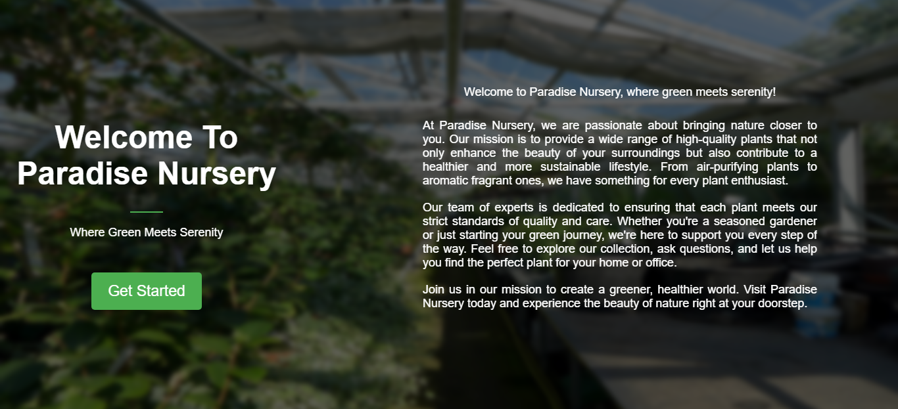
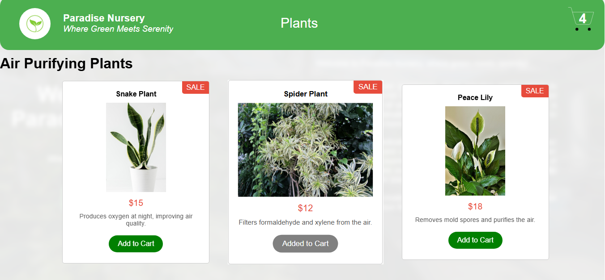
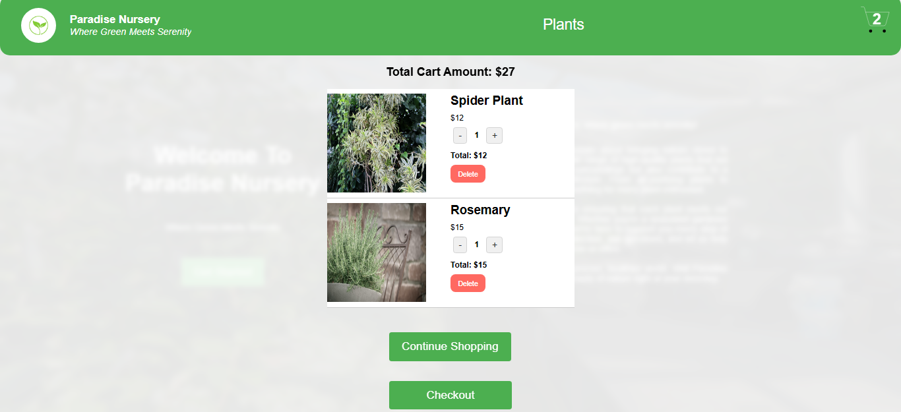

# Paradise Nursery Shopping Application

An e-commerce web application for Paradise Nursery, enabling users to browse, search, and purchase plants online. Built with React and Vite for fast, modern development.

## Table of Contents
- [Features](#features)
- [Getting Started](#getting-started)
- [Folder Structure](#folder-structure)
- [Technologies Used](#technologies-used)
- [Contributing](#contributing)
- [License](#license)
- [Contact](#contact)

## Features
- Browse a wide variety of plants  
  
- View product listings  
  
- Add plants to shopping cart and view cart  
  
- Fast performance with Vite

## Getting Started

### Prerequisites
- Node.js (v16 or above recommended)
- npm or yarn

### Installation
```bash
git clone https://github.com/rababfatma13/e-plantShopping
cd e-plantShopping
npm install
```

### Running the App
```bash
npm run dev
```
Open [http://localhost:5173](http://localhost:5173) in your browser.

## Folder Structure
```
e-plantShopping/
├── docs/             # Documentation assets (screenshots, logos, etc.)
│   └── images/       # Images used in README and docs
├── public/           # Static assets
├── src/              # Source code
│   ├── assets/       # Images and icons for app
│   ├── AboutUs.jsx   # About Us page
│   ├── CartItem.jsx  # Cart item component
│   ├── CartSlice.jsx # Redux slice for cart
│   ├── ProductList.jsx # Product listing
│   ├── store.js      # Redux store
│   └── ...           # Other components and styles
├── index.html        # Main HTML file
├── package.json      # Project metadata and scripts
├── vite.config.js    # Vite configuration
└── README.md         # Project documentation
```

## Technologies Used
- React
- Redux Toolkit
- Vite
- JavaScript (ES6+)
- HTML5 + CSS3
- GitHub Pages

## Contributing
Contributions are welcome! Please open issues or submit pull requests for improvements and bug fixes.

## License
This project is licensed under the MIT License. See the [LICENSE](LICENSE) file for details.

# Note
> This project was forked from [e-plantShopping](https://github.com/ibm-developer-skills-network/e-plantShopping).
